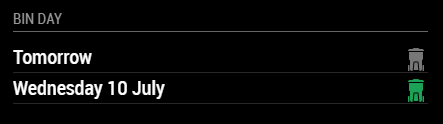

# MMM-WestBerksBinDay
Magic Mirror Module to display bin collection details from West Berkshire Council's API

## Installation

Clone this repository in your modules folder, and install dependencies:

    cd ~/MagicMirror/modules 
    git clone https://github.com/hdurdle/MMM-WestBerksBinDay.git
    cd MMM-WestBerksBinDay
    npm install 

## Configuration

Go to the MagicMirror/config directory and edit the config.js file. Add the module to your modules array in your config.js.

You'll need your uprn (Unique Property Reference Number) from the West Berks Council website. You can find this by searching for your address here: http://ww2.westberks.gov.uk/internetmapping/AddressFinder_v2.aspx

You'll get a 12 digit number. Enter this in the config.js for your MagicMirror installation:

        {
            module: 'MMM-WestBerksBinDay',
            position: 'top_left',
            header: 'Bin Day',
            config: {
                uprn: "123456789012",
                dateFormat: "dddd D MMMM"
            }
        },

## Module configuration
The module only has two possible configuration options:

<table>
  <thead>
    <tr>
      <th>Option</th>
      <th>Description</th>
    </tr>
  </thead>
  <tbody>
    <tr>
      <td><code>uprn</code></td>
      <td>Unique Property Reference Number for your house.  <strong>Default: </strong><code>undefined</code></td>
    </tr>
    <tr>
      <td><code>dateFormat</code></td>
      <td>Format to use for the date of events   <strong>Default: </strong><code>dddd D MMMM</code> (e.g. January 18) <strong>Possible values: </strong>See https://momentjs.com/</td>
    </tr>
  </tbody>
</table>

## Notes

The module is currently hard-coded to pull only the Grey and Green (recycling) bin details from the API. The API does contain other details - bulky waste, container maintenance etc - but those are not as useful on a week to week basis.

## Thanks

Hat tip to [Harm Tilburgs](https://github.com/htilburgs) and his [MMM-MyGarbage](https://github.com/htilburgs/MMM-MyGarbage) module, which inspired this code, and provided the nice SVG icons.